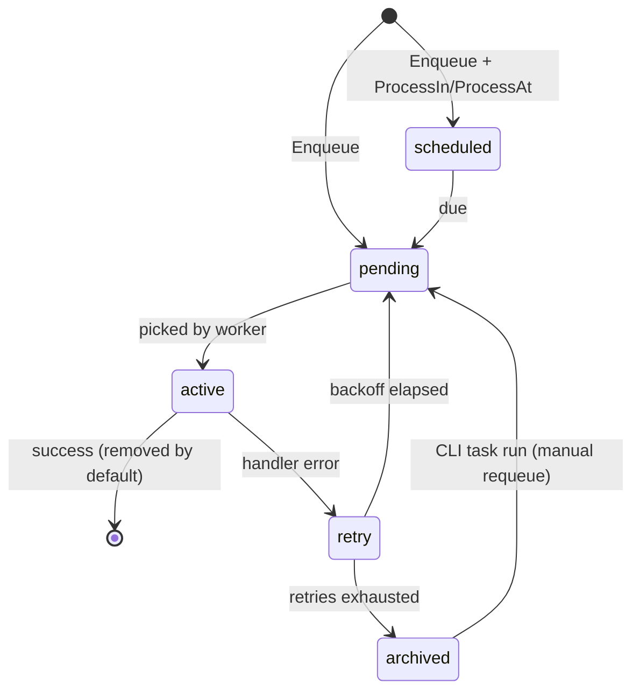

# Asynq User Manual (team fork: austinyuch/asynq)

> Version baseline: `v0.26.0-team.1` (2026-06-07, regeneration #2). Every output in this manual was **captured live in the fork environment** (Valkey 9.1.0 + real API) and is reproducible via [`docs/manual/demo/main.go`](../demo/main.go); regeneration steps: [`docs/MANUAL_GENERATION_GUIDE.md`](../../MANUAL_GENERATION_GUIDE.md).
>
> Product surface classification: **Backend / Tool / CLI Dominant** — evidence is command output, not browser screenshots. Readiness verdicts belong to the review documents (`docs/review/`); this manual makes no production-readiness claims of its own.

## Contents

1. [Overview](#1-overview)
2. [Getting Started / Starter Assets](#2-getting-started--starter-assets)
3. [Flow A: Enqueue & Worker Processing](#3-flow-a-enqueue--worker-processing)
4. [Flow B: Task State Lifecycle](#4-flow-b-task-state-lifecycle)
5. [Flow C: CLI Operations](#5-flow-c-cli-operations)
6. [Flow D: Interactive Dashboard (`asynq dash`)](#6-flow-d-interactive-dashboard-asynq-dash)
7. [Flow E: Prometheus Monitoring](#7-flow-e-prometheus-monitoring)
8. [Visual Evidence Gap Inventory](#8-visual-evidence-gap-inventory)

---

## 1. Overview

Asynq is a Go distributed task queue library backed by Redis-compatible servers (this fork validates against **Valkey**). This manual covers the team fork `github.com/austinyuch/asynq`:

| Audience | Entry point |
|---|---|
| App developers (enqueue / worker) | root module: `Client`, `Server`, `ServeMux`, `Inspector` |
| Operations (queue inspection) | CLI: `tools/asynq` |
| Monitoring | `tools/metrics_exporter` (Prometheus), `x/metrics` collector |

Fork governance (branch model, release tags, upstream sync): [`FORK.md`](../../../FORK.md).

## 2. Getting Started / Starter Assets

### Install (real commands, e2e-verified)

```bash
go get github.com/austinyuch/asynq@v0.26.0-team.1
go install github.com/austinyuch/asynq/tools/asynq@tools/v0.26.0-team.1
docker run -d --name asynq-valkey -p 6379:6379 valkey/valkey:9.1.0
```

### Starter assets (git-tracked, downloadable)

| File | Purpose |
|---|---|
| [`demo/main.go`](../demo/main.go) | **Canonical seed program**: real API walk through enqueue → worker → unique rejection → retry→archive → scheduled → Inspector stats |
| [`assets/getting-started-demo-seed-01.txt`](../assets/getting-started-demo-seed-01.txt) | Its real output (source of every number in this manual) |

Run the seed (data goes to **DB 13**, isolated from the test suite, repeatable):

```bash
go run ./docs/manual/demo -redis_addr=localhost:6379
```

## 3. Flow A: Enqueue & Worker Processing

**Scenario**: the application offloads slow work (emails, image processing) to queues; a worker drains `critical`/`default`/`low` with 6:3:1 weights.

```go
client := asynq.NewClient(asynq.RedisClientOpt{Addr: "localhost:6379"})
info, _ := client.Enqueue(asynq.NewTask("email:welcome", payload), asynq.Queue("critical"))

srv := asynq.NewServer(opt, asynq.Config{
    Concurrency: 4,
    Queues:      map[string]int{"critical": 6, "default": 3, "low": 1},
})
mux := asynq.NewServeMux()
mux.HandleFunc("email:welcome", handleWelcomeEmail)
srv.Run(mux)
```

Real run (excerpt from [`assets/getting-started-demo-seed-01.txt`](../assets/getting-started-demo-seed-01.txt)):

```text
== 1. Enqueue real workloads =====================================
  enqueued id=d93d6fc7 type=email:welcome    queue=critical state=pending
  enqueued id=c5e3e65c type=report:generate  queue=low      state=scheduled
  duplicate rejected: cleanup:tmp -> task already exists
  enqueued id=c301e025 type=billing:charge   queue=critical state=pending

== 2. Process with a real worker Server =========================
  processed email:welcome  user=1001 locale=zh-TW
  processed image:resize   width=640 src=s3://demo-bucket/cat.png
```

> Evidence Source: live command output (seeded demo data) / Coverage Tier: full-integration (section-level) / Readiness State: not_assessed (no review.md verdict)

Note the **real** unique-option rejection (`task already exists`) and the `ProcessIn(2h)` task landing directly in `scheduled`.

## 4. Flow B: Task State Lifecycle



Real Inspector statistics after seeding (`billing:charge` has MaxRetry=0, so one failure archives it):

```text
  queue          size   pending    active    sched  archived  processed
  critical          1         0         0        0         1          4
  default           0         0         0        0         0          2
  low               1         0         0        1         0          1

== 4. Archived task detail (retry exhausted) =====================
  id=c301e025 type=billing:charge last_err="card declined" retried=0/0
```

> Evidence Source: live command output (seeded demo data) / Coverage Tier: full-integration (section-level) / Readiness State: not_assessed

## 5. Flow C: CLI Operations

| Command | Purpose | Real output |
|---|---|---|
| `asynq --uri localhost:6379 --db 13 stats` | Global stats (states × queues × daily error rate × Redis info) | [`assets/cli-stats-01.txt`](../assets/cli-stats-01.txt) |
| `asynq ... queue ls` | List queues | [`assets/cli-queue-ls-01.txt`](../assets/cli-queue-ls-01.txt) |
| `asynq ... task ls --queue critical --state archived` | List archived tasks with last error | [`assets/cli-task-ls-archived-01.txt`](../assets/cli-task-ls-archived-01.txt) |

`stats` excerpt:

```text
Daily Stats 2026-06-07 UTC
processed  failed  error rate
---------  ------  ----------
7          1       14.29%

Redis Info
version  uptime  connections  memory usage  peak memory usage
-------  ------  -----------  ------------  -----------------
7.2.4    0 days  1            1.78MB        1.80MB
```

> Evidence Source: live command output (seeded demo data) / Coverage Tier: full-integration (section-level) / Readiness State: not_assessed
>
> 💡 **Valkey compatibility evidence**: `version 7.2.4` is Valkey 9.1.0's reported Redis-compat version — the CLI works against Valkey unchanged.

Follow-up operations: `asynq task run --queue critical --id <ID>` (requeue), `asynq task delete ...`, `asynq queue pause <name>`.

## 6. Flow D: Interactive Dashboard (`asynq dash`)

**Scenario**: operators want a live view of queue depth and error rate without re-running `stats`.

```bash
asynq --uri localhost:6379 --db 13 dash
```

Main screen, captured live via tmux `capture-pane` (2026-06-07; full file: [`assets/cli-dash-queues-01.txt`](../assets/cli-dash-queues-01.txt)):

```text
=== Queues ===

critical |▇ 1
default  | 0
low      |▇ 1

Queue        State     Size     Latency     MemoryUsage     Processed     Failed     ErrorRate
critical     RUN          1          0s           488 B             4          1          0.25
default      RUN          0          0s             0 B             2          0          0.00
low          RUN          1          0s           448 B             1          0          0.00
```

Select a queue and press Enter for the Queue Summary ([`assets/cli-dash-queue-detail-01.txt`](../assets/cli-dash-queue-detail-01.txt)):

```text
=== Queue Summary ===

Name      critical
Size      1
Latency   0s
MemUsage  488 B

=== Tasks ===

Active:0    Pending:0    Aggregating:0    Scheduled:0    Retry:0    Archived:1    Completed:0
```

> Evidence Source: live TUI text capture (tmux capture-pane, seeded demo data) / Coverage Tier: full-integration (section-level, text content) / Readiness State: not_assessed
>
> ⚠️ This captures the TUI's **text layer**: numbers and layout are real dash output; colors/cursor rendering are outside the capture scope (`ARTIFACT_HONESTY_GAP` narrowed, see section 8).

## 7. Flow E: Prometheus Monitoring

```bash
go run ./tools/metrics_exporter -redis-addr=localhost:6379 -redis-db=13 -port=9876
curl -s localhost:9876/metrics | grep '^asynq_'
```

Real payload excerpt (full 36 series: [`assets/monitoring-metrics-curl-01.txt`](../assets/monitoring-metrics-curl-01.txt)):

```text
asynq_queue_size{queue="critical"} 1
asynq_tasks_enqueued_total{queue="critical",state="archived"} 1
asynq_queue_memory_usage_approx_bytes{queue="critical"} 488
```

> Evidence Source: live HTTP payload (`GET /metrics`) / Coverage Tier: full-integration (section-level) / Readiness State: not_assessed

The archived counter matches Flow B's Inspector stats, Flow C's CLI output, and Flow D's dash screen — the same seeded dataset is consistent across all four surfaces.

## 8. Visual Evidence Gap Inventory

| Item | Status | Code |
|---|---|---|
| `asynq dash` interactive TUI | **Text layer now captured live** (tmux capture-pane, Flow D); color/graphics rendering still not assessed | `ARTIFACT_HONESTY_GAP` (narrowed) |
| `docs/assets/` (dash.gif, asynqmon-*.png, …) | **Inherited from upstream**, not re-captured in the fork (Valkey) environment | `ARTIFACT_HONESTY_GAP` |
| Asynqmon Web UI | External project, out of scope for this repo's verification | illustrative reference |

**Gaps resolved since last check** (previous check: 2026-06-07 first generation; this run: 2026-06-07 regeneration #2):

- ✅ **`assets/*.txt` evidence files had never been committed** (manual links were dead) — this run adds 7 git-tracked assets; every evidence link now downloads
- ✅ **First live fork-environment captures of the `asynq dash` TUI** (tmux capture-pane ×2: Queues main screen + Queue Summary) — the dash part of IL-003 narrows from "no capture at all" to "graphics layer only"
- ✅ All numbers regenerated 2026-06-07 under the governed allocation; four surfaces (seed/CLI/dash/exporter) are mutually consistent
- ⏳ Still open: IL-003 remainder (`docs/assets/` upstream media not re-shot; dash graphics layer)

---

*Regenerate: see [`docs/MANUAL_GENERATION_GUIDE.md`](../../MANUAL_GENERATION_GUIDE.md). 中文版: [`../zh-tw/index.md`](../zh-tw/index.md).*
