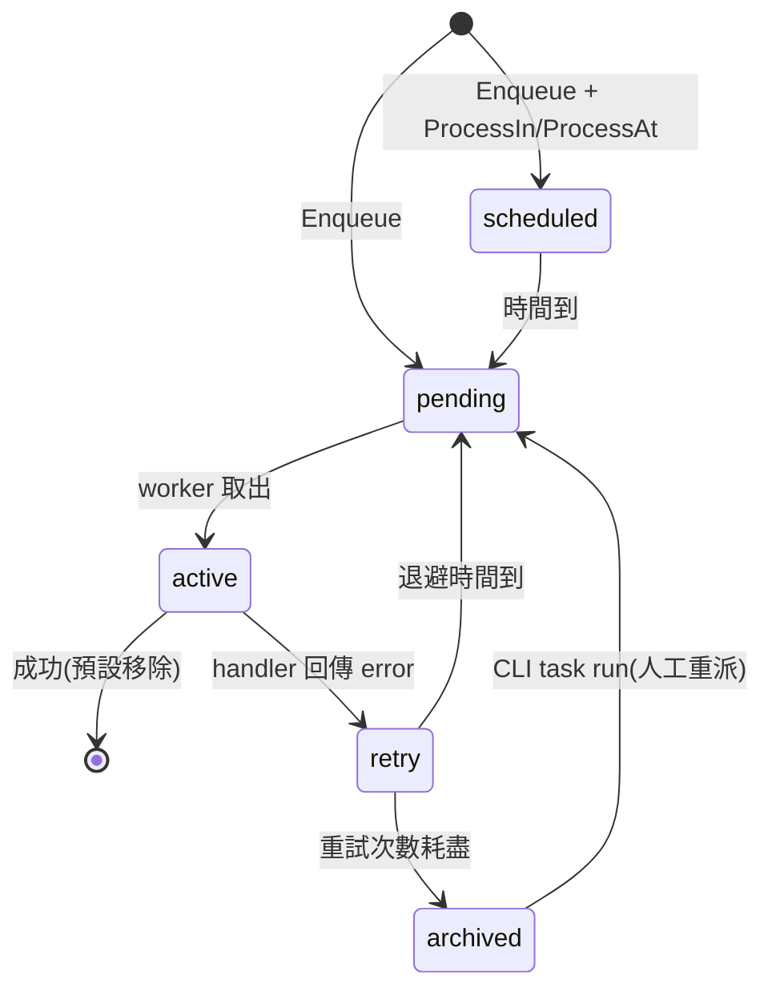

# Asynq 使用手冊(team fork:austinyuch/asynq)

> 版本基準:`v0.26.0-team.1`(2026-06-07)。本手冊所有輸出均為 **fork 環境真實擷取**(Valkey 9.1.0 + 真實 API),可由 [`docs/manual/demo/main.go`](../demo/main.go) 重現;再生方式見 [`docs/MANUAL_GENERATION_GUIDE.md`](../../MANUAL_GENERATION_GUIDE.md)。
>
> 產品操作面分類:**Backend / Tool / CLI Dominant** — evidence 以命令輸出為主,非瀏覽器截圖。Readiness 裁決權威在 review 文件(見 `docs/review/`),本手冊不自行宣稱 production-ready。

## 目錄

1. [系統簡介](#1-系統簡介)
2. [Getting Started / Starter Assets](#2-getting-started--starter-assets)
3. [流程 A:Enqueue 與 Worker 處理](#3-流程-aenqueue-與-worker-處理)
4. [流程 B:任務狀態生命週期](#4-流程-b任務狀態生命週期)
5. [流程 C:CLI 查詢與維運](#5-流程-ccli-查詢與維運)
6. [流程 D:Prometheus 監控](#6-流程-dprometheus-監控)
7. [視覺素材 Gap 盤點](#7-視覺素材-gap-盤點)

---

## 1. 系統簡介

Asynq 是 Go 的分散式任務佇列 library,以 Redis 相容伺服器(本 fork 以 **Valkey** 驗證)為後端。這份手冊對應 team fork `github.com/austinyuch/asynq`:

| 角色 | 入口 |
|---|---|
| 應用開發者(enqueue / worker) | root module:`Client`、`Server`、`ServeMux`、`Inspector` |
| 維運(查詢/操作佇列) | CLI:`tools/asynq` |
| 監控 | `tools/metrics_exporter`(Prometheus)、`x/metrics` collector |

Fork 治理(branch model、release tags、upstream sync)見 [`FORK.md`](../../../FORK.md)。

## 2. Getting Started / Starter Assets

### 安裝(真實可執行,已 e2e 驗證)

```bash
# Library
go get github.com/austinyuch/asynq@v0.26.0-team.1

# CLI(tools module 無 replace,可直接 go install)
go install github.com/austinyuch/asynq/tools/asynq@tools/v0.26.0-team.1

# 本地 Valkey(版本同 CI)
docker run -d --name asynq-valkey -p 6379:6379 valkey/valkey:9.1.0
```

### Starter assets(git-tracked,可直接下載)

| 檔案 | 用途 |
|---|---|
| [`demo/main.go`](../demo/main.go) | **canonical seed 程式**:真實 API 走完 enqueue → worker → unique 拒絕 → retry→archive → scheduled → Inspector 統計 |
| [`assets/getting-started-demo-seed-01.txt`](../assets/getting-started-demo-seed-01.txt) | seed 程式的真實輸出(本手冊各節引用的數據來源) |

執行 seed(demo 資料寫入 **DB 13**,與測試套件隔離、可重複執行):

```bash
go run ./docs/manual/demo -redis_addr=localhost:6379
```

## 3. 流程 A:Enqueue 與 Worker 處理

**情境**:應用程式把耗時工作(寄信、影像處理)丟進佇列,由 worker 非同步處理;`critical`/`default`/`low` 以 6:3:1 權重排程。

最小程式骨架(與 seed 程式一致;完整版見 [`demo/main.go`](../demo/main.go)):

```go
client := asynq.NewClient(asynq.RedisClientOpt{Addr: "localhost:6379"})
info, _ := client.Enqueue(asynq.NewTask("email:welcome", payload), asynq.Queue("critical"))

srv := asynq.NewServer(opt, asynq.Config{
    Concurrency: 4,
    Queues:      map[string]int{"critical": 6, "default": 3, "low": 1},
})
mux := asynq.NewServeMux()
mux.HandleFunc("email:welcome", handleWelcomeEmail)
srv.Run(mux)
```

真實執行結果(節錄自 [`assets/getting-started-demo-seed-01.txt`](../assets/getting-started-demo-seed-01.txt)):

```text
== 1. Enqueue real workloads =====================================
  enqueued id=b4221de8 type=email:welcome    queue=critical state=pending
  enqueued id=966c11ff type=report:generate  queue=low      state=scheduled
  duplicate rejected: cleanup:tmp -> task already exists
  enqueued id=61539754 type=billing:charge   queue=critical state=pending

== 2. Process with a real worker Server =========================
  processed email:welcome  user=1001 locale=zh-TW
  processed image:resize   width=640 src=s3://demo-bucket/cat.png
```

> Evidence Source:live command output(seeded demo data)/ Coverage Tier:full-integration(section-level)/ Readiness State:not_assessed(無 review.md 裁決)

**重點解讀**:`Unique(time.Hour)` 的第二次 enqueue 被真實拒絕(`task already exists`);`ProcessIn(2h)` 的任務直接落在 `scheduled` 狀態。

## 4. 流程 B:任務狀態生命週期



真實的 Inspector 統計(seed 後;`billing:charge` MaxRetry=0 故一次失敗即 archived):

```text
  queue          size   pending    active    sched  archived  processed
  critical          1         0         0        0         1          4
  default           0         0         0        0         0          2
  low               1         0         0        1         0          1

== 4. Archived task detail (retry exhausted) =====================
  id=61539754 type=billing:charge last_err="card declined" retried=0/0
```

> Evidence Source:live command output(seeded demo data)/ Coverage Tier:full-integration(section-level)/ Readiness State:not_assessed

## 5. 流程 C:CLI 查詢與維運

**情境**:維運人員檢查佇列健康、找出失敗任務。

| 命令 | 用途 | 真實輸出 |
|---|---|---|
| `asynq --uri localhost:6379 --db 13 stats` | 全域統計(狀態×佇列×當日錯誤率×Redis info) | [`assets/cli-stats-01.txt`](../assets/cli-stats-01.txt) |
| `asynq ... queue ls` | 列出佇列 | [`assets/cli-queue-ls-01.txt`](../assets/cli-queue-ls-01.txt) |
| `asynq ... task ls --queue critical --state archived` | 列出封存任務(含最後錯誤) | [`assets/cli-task-ls-archived-01.txt`](../assets/cli-task-ls-archived-01.txt) |

`stats` 真實輸出節錄:

```text
Daily Stats 2026-06-06 UTC
processed  failed  error rate
---------  ------  ----------
7          1       14.29%

Redis Info
version  uptime  connections  memory usage  peak memory usage
-------  ------  -----------  ------------  -----------------
7.2.4    0 days  2            1.76MB        1.77MB
```

> Evidence Source:live command output(seeded demo data)/ Coverage Tier:full-integration(section-level)/ Readiness State:not_assessed
>
> 💡 **Valkey 相容性證據**:`version 7.2.4` 是 Valkey 9.1.0 回報的 Redis 相容版本 — CLI 對 Valkey 後端完全照常工作。

封存任務的真實樣貌(用於排錯:`Last Error` 直接給出 handler 的失敗原因):

```text
ID                                    Type            Payload                Last Error
61539754-d18e-4a93-8fa8-7fc8a2cbf790  billing:charge  {"invoice":"INV-042"}  card declined
```

常用後續操作:`asynq task run --queue critical --id <ID>`(重派)、`asynq task delete ...`(刪除)、`asynq queue pause <name>`(暫停消費)。

## 6. 流程 D:Prometheus 監控

**情境**:SRE 要把佇列深度、失敗率接進 Prometheus/Grafana。

```bash
# 啟動 exporter(真實 HTTP 服務)
go run ./tools/metrics_exporter -redis-addr=localhost:6379 -redis-db=13 -port=9876
curl -s localhost:9876/metrics | grep '^asynq_'
```

真實 payload 節錄(完整 36 series 見 [`assets/monitoring-metrics-curl-01.txt`](../assets/monitoring-metrics-curl-01.txt)):

```text
asynq_queue_size{queue="critical"} 1
asynq_queue_latency_seconds{queue="default"} 0
asynq_tasks_enqueued_total{queue="critical",state="archived"} 1
asynq_queue_memory_usage_approx_bytes{queue="critical"} 488
```

> Evidence Source:live HTTP payload(`GET /metrics`)/ Coverage Tier:full-integration(section-level)/ Readiness State:not_assessed

注意 `asynq_tasks_enqueued_total{...state="archived"} 1` 與流程 B 的 Inspector 統計、流程 C 的 CLI 輸出**三方一致** — 同一份 demo 資料貫穿全部 surface。

## 7. 視覺素材 Gap 盤點

| 項目 | 狀態 | Code |
|---|---|---|
| `asynq dash` 互動 TUI | 本手冊產生於無頭環境,無法擷取 TUI 畫面;功能以 CLI 文字輸出佐證,TUI 視覺**未評估** | `DEMO_NOT_ASSESSED` |
| `docs/assets/`(dash.gif、asynqmon-*.png 等) | **承襲 upstream 的素材**,非 fork 環境(Valkey)重攝;README 引用它們僅為示意 | `ARTIFACT_HONESTY_GAP` |
| Asynqmon Web UI | 外部專案([hibiken/asynqmon](https://github.com/hibiken/asynqmon)),不在本 repo 驗證範圍 | illustrative reference |

**Gaps resolved since last check**(基線 2026-06-07,首次生成):

- ✅ 手冊 evidence 全面改為 fork 環境真實輸出(先前僅有承襲 upstream 的 README 素材)
- ✅ `ISSUE_LOG.md` IL-R01(CI 事件觸發)、IL-R02(`go install` 支援)、IL-R03(rename 漏網)— 解決過程使本手冊的安裝指令成為真實可執行
- ⏳ 仍 open:IL-003(visual 缺口,即上表前兩列)

---

*再生本手冊:見 [`docs/MANUAL_GENERATION_GUIDE.md`](../../MANUAL_GENERATION_GUIDE.md)。English version: [`../en/index.md`](../en/index.md)。*
